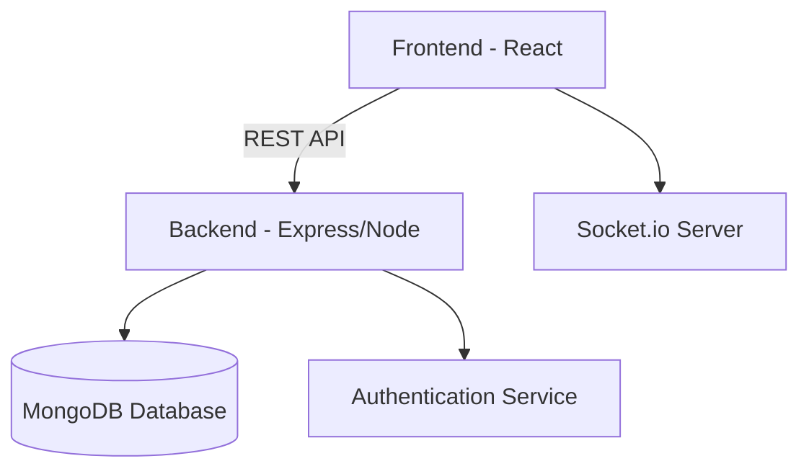

# 🕸️ DevNest: The Upside Down of Full-Stack Development Learning

> *"In the world of code, there's always another layer... Welcome to the Upside Down."*

DevNest is a **Stranger Things–themed full-stack development learning platform** that transforms coding education into an immersive adventure. Learn full-stack development through **quests, mysteries, and challenges** inspired by Hawkins, the Mind Flayer, and the Upside Down.  

**⚠️ Experimental Development:** This is an experimental website currently in development with a Stranger Things theme. Features are subject to change, and bugs may lurk in the shadows.

---

## 🌌 Table of Contents

- [Overview](#-overview)
- [Features](#-features)
- [Tech Stack](#-tech-stack)
- [Architecture](#-architecture)
- [Installation](#-installation)
- [Usage](#-usage)
- [Themed Elements](#-themed-elements)
- [Future Roadmap](#-future-roadmap)
- [Contributing](#-contributing)
- [License](#-license)

---

## 🧠 Overview

DevNest bridges storytelling and software education. Whether you’re just entering the *Upside Down of Web Dev* or already a **Demogorgon-level coder**, you’ll find interactive modules, live challenges, and community-driven learning — all wrapped in an eerie 80s aesthetic.  

Students progress through:
- 👾 *Hawkins Labs* — Core lessons on HTML, CSS, JS, React, Node, etc.
- 🧩 *The Mind Flayer Challenges* — Real-world coding problems.
- 🪞 *The Upside Down Arena* — Pair programming and team hack quests.
- 🕹️ *Arcade Achievements* — Earn XP, ranks, and special items for progress.

---

## ⚙️ Features

- 🎯 **Structured Learning Paths** – Frontend, Backend, Database, and Deployment.
- 👨‍💻 **Interactive Code Editor** – Write and run code directly in-browser.
- 🧩 **Gamified Missions** – Unlock new levels and lore by completing lessons.
- 📜 **Progress Tracker** – Save progress locally or via user authentication.
- 💬 **Community Feed** – Share tips, discuss bugs, and form study groups.
- 🌑 **Dark Mode** (Upside Down Mode) – Experience coding from the other side.

---

## 💻 Tech Stack

**Frontend:**
- React.js + Vite
- Tailwind CSS / Framer Motion
- Redux Toolkit for state management

**Backend:**
- Node.js / Express.js
- MongoDB with Mongoose
- JWT Authentication

**Other Tools:**
- Socket.io (for live collaboration)
- Cloudinary (media handling)
- Firebase (optional for real-time features)
- Render / Vercel for deployment

---

## 🧱 Architecture

