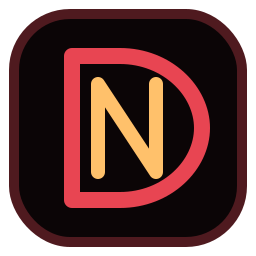

# DevNest

<p align="center">
  
</p>

<p align="center">
  A cinematic, Stranger Things-inspired learning platform for developers.
</p>

<p align="center">
  
  
  
  
  
</p>

---

## Product Vision

DevNest blends story-driven atmosphere with practical developer training:

- Guided roadmaps and role-based learning paths
- Firebase-authenticated protected routes
- Framer Motion transitions and Three.js ambient visuals
- Strong visual identity with reusable design tokens and brand iconography

---

## Experience Highlights

| Area | What You Get |
|---|---|
| Landing | Cinematic hero, animated sections, themed storytelling |
| Portal | Structured path cards with skills, modules, and journey actions |
| Roadmaps | Multi-module progression with visual tracking |
| Pricing | Tiered plans, FAQ, and conversion CTA |
| Auth | Route guard + branded loading state with logo |

---

## Tech Stack

| Layer | Stack |
|---|---|
| Framework | Next.js App Router |
| UI | React 19, Tailwind CSS v4 |
| Motion | Framer Motion |
| 3D / Visuals | Three.js, Recharts |
| Auth | Firebase Auth |
| Language | TypeScript |

---

## Project Structure

```text
src/
  app/
    layout.tsx
    page.tsx
    icon.svg
    login/
    portal/
    pricing/
    roadmaps/
  components/
    auth/
    background/
    features/
    home/
    portal/
    pricing/
    roadmaps/
    shared/
      BrandIcon.tsx
      Header.tsx
      Footer.tsx
  data/
  lib/
public/
  brand-icon.svg
```

---

## Quick Start

```bash
npm install
npm run dev
```

Open `http://localhost:3000`.

---

## Environment Variables

Create `.env.local`:

```env
NEXT_PUBLIC_FIREBASE_API_KEY=your_api_key
NEXT_PUBLIC_FIREBASE_AUTH_DOMAIN=your_project.firebaseapp.com
NEXT_PUBLIC_FIREBASE_PROJECT_ID=your_project_id
NEXT_PUBLIC_FIREBASE_STORAGE_BUCKET=your_bucket
NEXT_PUBLIC_FIREBASE_MESSAGING_SENDER_ID=your_sender_id
NEXT_PUBLIC_FIREBASE_APP_ID=your_app_id
```

---

## Scripts

| Command | Purpose |
|---|---|
| `npm run dev` | Start development server |
| `npm run build` | Build production bundle |
| `npm run start` | Run production server |
| `npm run lint` | Run ESLint |

---

## Contributing

Please read [CONTRIBUTING.md](CONTRIBUTING.md) before opening a PR.

---

## License

This project is licensed under the [MIT License](LICENSE).
